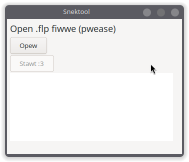

# Snektool

Simple `.flp` (FL Studio project) samples exporter. Supported file formats: `.ogg`, `.mp3`, `.wav`


### Install

Just download from [releases page](https://github.com/vustur/snektool/releases/)

### Build

1. Clone repo
2. Build with ```nim c --outdir:build snektool.nim``` on Windows or ```nimxc c --target windows-amd64 --outdir:build snektool.nim``` using [nimxc](https://github.com/iffy/nimxc) on Linux or Mac

### Other

If you have any questions or suggestions, please open issue or contact me on [telegram](https://t.me/vustur) (Also check my [tg channel](https://t.me/vusturs) / [site](https://vustur.xyz) with my projects!)


*snek.*
